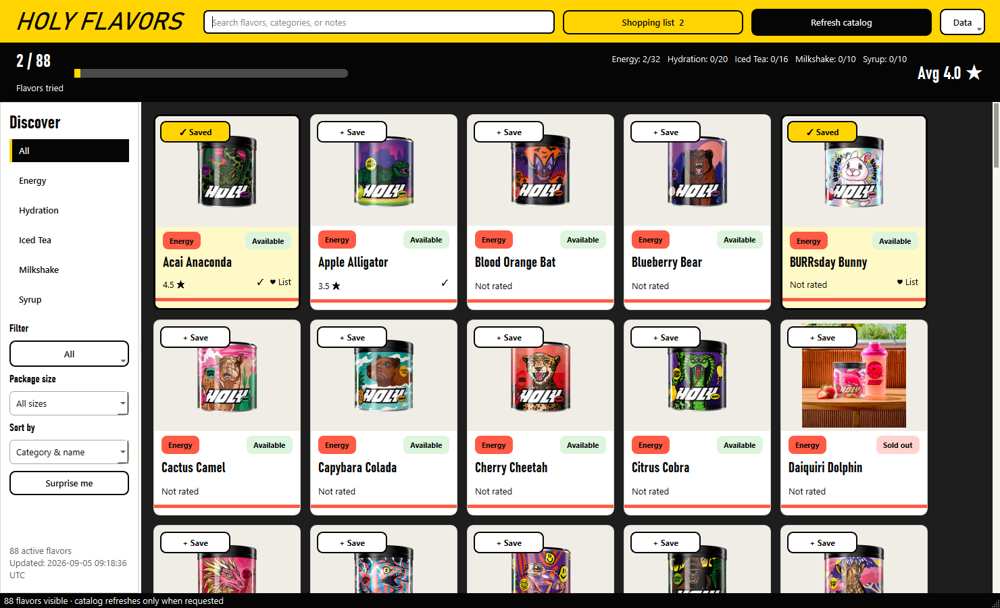
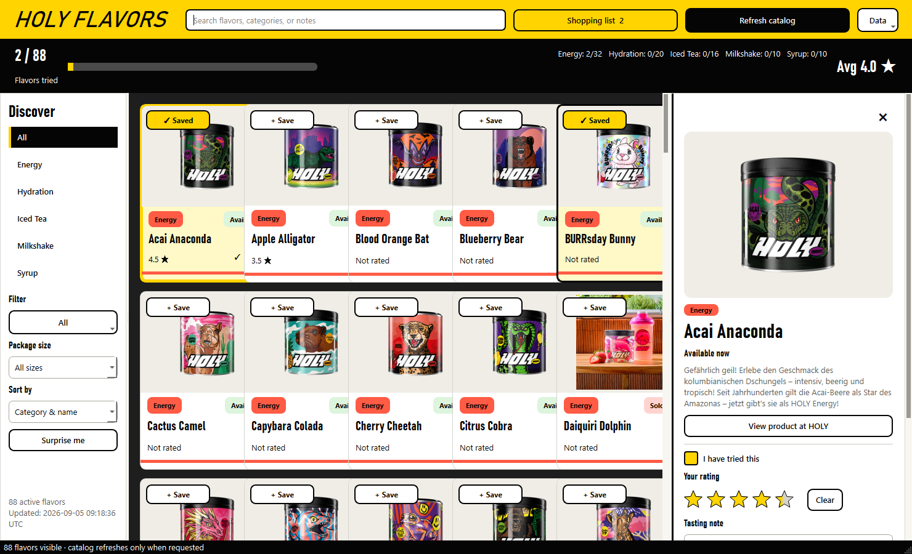

<div align="center">

# HOLY Flavors

**A colorful Windows desktop companion for discovering, rating, and restocking HOLY drink flavors.**


</div>

HOLY Flavors turns the public German HOLY catalog into a calm, image-first desktop app. Keep track of what you have tried, rate flavors in half-star steps, write tasting notes, build a shopping list, and open a prefilled HOLY cart in your browser—without an account or embedded checkout.

## Screenshots





The screenshots use temporary demo data. No personal ratings, notes, backups, or shopping-list entries are included in this repository.

## Highlights

- Browse Energy, Hydration, Iced Tea, Milkshake, and Syrup flavors from `de.holy.com`.
- Combine search, multiple categories, multiple status filters, and package sizes.
- Switch between samples, 10-serving boxes, 50-serving tubs, and syrup packs with matching product images.
- Rate tried flavors from 0.5 to 5 stars and add private tasting notes.
- See overall and per-category tasting progress plus your average rating.
- Pick a random visible flavor that you have not tried yet.
- Keep a shopping list with variant and quantity validation.
- Open a Shopify cart permalink in the default browser; checkout always stays on HOLY.
- Export a full JSON backup or an Excel-friendly UTF-8 CSV file.
- Refresh only when you choose to; the app starts from its local cache and remains usable offline.

## Quick start on Windows

### 1. Install Python and dependencies

Install Python 3.13, clone the repository, then run:

```powershell
py -3 -m pip install -r requirements.txt
```

### 2. Start without a console window

Double-click **`Start-Holy-Flavors.vbs`**. It launches the `.pyw` entry point through `pyw.exe`, so no Command Prompt window remains visible while the app runs.

You can also double-click `Holy-Flavors.pyw`. `Start-Holy-Flavors.bat` is included as a fallback and closes immediately after launching the GUI.

For development or troubleshooting, start it from a terminal:

```powershell
py -3 main.py
```

### 3. Load the catalog

On the first launch, click **Refresh catalog**. The app deliberately performs no automatic network request at startup. A successful refresh downloads all five supported collections atomically, validates them, and caches resized product images locally.

## How local data stays private

Everything generated while using the app lives below `data/`:

| Path | Contents |
| --- | --- |
| `data/catalog_cache.json` | Last complete catalog refresh |
| `data/images/` | Resized product and variant images |
| `data/user_state.json` | Ratings, notes, tried state, and shopping list |
| `data/backups/` | Safety copies created before imports |

The entire generated data area is ignored by Git except for an empty `.gitkeep` placeholder. Personal data is never required for the app to run, and no HOLY credentials are stored.

## Shopping-cart behavior

The shopping list creates a Shopify cart permalink in this format:

```text
https://de.holy.com/cart/<variant>:<quantity>,...?storefront=true
```

Before opening it, the app shows every selected flavor, package size, and quantity. Opening the link may replace an existing HOLY cart in that browser. The app does not place an order, access your HOLY account, or handle checkout and payment.

## Project structure

```text
holy_flavors/       Application UI, catalog parsing, services, and storage
tests/              Parser, persistence, service, and offscreen UI tests
data/               Local runtime data (ignored by Git)
docs/screenshots/   Privacy-safe demo screenshots
main.py             Development entry point
Holy-Flavors.pyw    Console-free Windows entry point
```

## Run the tests

```powershell
py -3 -m unittest discover -s tests -v
py -3 -m compileall -q main.py Holy-Flavors.pyw holy_flavors tests
```

The suite covers catalog parsing, atomic persistence, import/export behavior, composable filters, responsive layouts, half-star ratings, shopping-list validation, cart URL generation, and PyQt6 offscreen smoke tests.

## Data source and disclaimer

Catalog data is fetched from the public Shopify collection endpoints of the German HOLY store. Flavor descriptions therefore retain the language provided by that source, while the application interface is English.

This is an independent, unofficial personal project and is not affiliated with, endorsed by, or sponsored by HOLY. HOLY names, product images, and trademarks belong to their respective owners. Prices and availability reflect the most recent manual refresh and can change before checkout.
